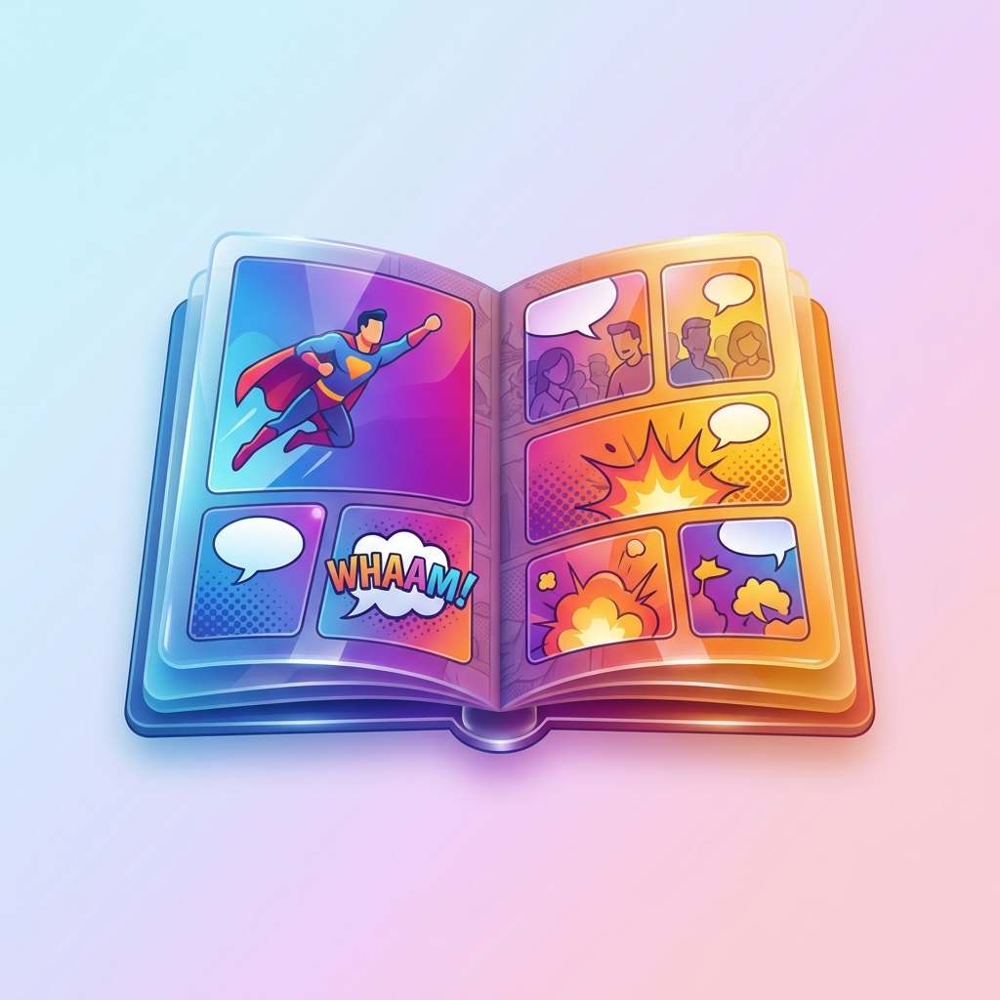

# MCV (Manga & Comic Viewer) 📖

<p align="center">
  
  <br>
  <strong>macOS를 위한 가볍고 강력한 네이티브 만화책 / 압축 아카이브 뷰어</strong>
</p>

<p align="center">
  
  
  
  
</p>

---

## ✨ 주요 기능 (Key Features)

### 📚 1. 책장 (Library) 모드
- **초고속 압축 파일 탐색**: ZIP / CBZ 압축 파일을 풀지 않고 디렉터리 구조 그대로 스트리밍 탐색
- **스마트 썸네일 캐싱**: 책 표지를 자동으로 추출하여 고품질 썸네일로 디스크에 캐싱 (최대 400px)
- **와이드(스프레드) 표지 크롭 영역 지정**: 가로로 긴 펼침면 표지를 `가운데` / `왼쪽(앞표지)` / `오른쪽(뒤표지)` / `전체` 중 선택하여 최적의 비율로 감상
- **정교한 정렬 옵션**: 최신순(폴더 내 가장 최근 파일 생성/수정일 기준), 이름순, 크기순 정렬 및 오름차순/내림차순 전환
- **책갈피(이어보기)**: 각 만화책별 마지막으로 읽은 페이지를 기억하여 책장 썸네일에 북마크 표시
- **키보드 탐색**: 방향키, `Return`, `Space`, `Backspace`/`Delete`로 완벽한 키보드 책장 탐색

### 🖼️ 2. 뷰어 (Viewer) 모드
- **다양한 읽기 모드**:
  - `단면 보기` / `양면 보기` 전환 (`'` 키)
  - `가로로 꽉 차게 보기` (`H` 키) 및 `세로 맞춤 보기` (`V` 키)
- **스마트 줌 & 자연스러운 패닝**:
  - **정해진 크기대로 확대 / 원위치 스마트 줌 토글** (`/` 키)
  - 트랙패드 핀치 제스처 / 두 손가락 더블 탭 / `+`, `-`, `0` 키로 확대/축소
  - 뷰포트 경계 제한(Clamping)으로 불필요한 검은 여백 노출 차단
  - 페이지 이동 시 스마트 위치 정렬 (다음 페이지 → 최상단, 이전 페이지 → 최하단/최상단 설정 가능)
  - 확대 상태에서도 페이지 가로 폭이 창 너비 이내일 경우 좌우 방향키로 자연스러운 페이지 이동 지원
- **고품질 화질 향상 필터**:
  - **Lanczos3 고화질 리샘플링 & 선명도(샤픈) 조절** (`S` 키)
  - **스마트 흑백 만화 자동 대비(Auto Contrast) 보정** (`A` 키)
- **macOS Liquid Glass(리퀴드 글래스) 스타일 하단바**:
  - 애플 최신 디자인 철학을 반영한 광학 렌즈 반사/굴절 및 캡슐 지오메트리 하단 컨트롤 바
- **상단 윈도우 타이틀바 연동**: 현재 감상 중인 책의 제목을 실시간으로 타이틀바에 표시
- **연속 읽기**: `[` 및 `]` 키로 이전 권 / 다음 권 즉시 이동
- **전체화면(Fullscreen)**: `F` 키 또는 윈도우 최대화 버튼 지원

---

## ⌨️ 단축키 일람 (Shortcuts)

### 뷰어 (Viewer) 모드
| 단축키 | 기능 설명 |
| :--- | :--- |
| `←` / `→`, `,` / `.` | 이전 / 다음 페이지 이동 (확대 시에는 패닝 또는 페이지 넘김) |
| `↑` / `↓` | 상/하 스크롤 및 확대 상태 패닝 |
| `Space` / `Shift+Space` | 화면 단위 상하 스크롤 (페이지 끝에서 다음/이전 페이지 넘김) |
| `'` (작은따옴표) | 단면 보기 / 양면 보기 전환 |
| `V` | 세로 맞춤 보기 |
| `H` | 가로로 꽉 차게 보기 토글 |
| `/` (슬래시) | 스마트 줌 토글 (설정된 배율로 확대 ⇄ 원래 크기) |
| `-, =, 0` | 축소, 확대, 100% 원래 크기 |
| `A` | 흑백 만화 자동 대비(Auto Contrast) 보정 토글 |
| `S` | 선명도(샤픈 필터) 단계 조절 (끄기 → 약하게 → 보통 → 강하게) |
| `[` / `]` | 이전 권 / 다음 권 이동 |
| `F` | 전체화면 모드 토글 |
| `ESC` | 책장으로 돌아가기 |

### 책장 (Library) 모드
| 단축키 | 기능 설명 |
| :--- | :--- |
| `←` / `→` / `↑` / `↓` | 책장 그리드 내 책/폴더 선택 이동 |
| `Return` / `Space` | 선택한 책 열기 또는 폴더 진입 |
| `Backspace` / `Delete` | 상위 폴더로 이동 |

---

## 🚀 설치 및 실행 (Installation)

### 1. 릴리즈 바이너리 다운로드 (권장)
- [GitHub Releases](https://github.com/) 탭에서 최신 버전의 `MCV_vX.X.X.zip`을 다운로드합니다.
- 압축을 해제한 후 `MCV.app`을 `/Applications`(응용 프로그램) 폴더로 이동하여 실행합니다.

### 2. 소스코드에서 직접 빌드
macOS 환경에서 터미널을 열고 아래 명령어를 실행합니다:

```bash
# 레포지토리 클론
git clone https://github.com/azurekingfisher/MCV.git
cd MCV

# .app 번들 자동 빌드 및 생성
bash create_app.sh
```
빌드가 완료되면 프로젝트 루트에 `MCV.app` 번들이 생성됩니다.

---

## 🛠️ 기술 스택 (Tech Stack)

- **Language**: Swift 5.9+
- **Framework**: SwiftUI, AppKit
- **Archive Engine**: [ZIPFoundation](https://github.com/weichsel/ZIPFoundation)
- **Image Processing**: Core Graphics, Core Image (Lanczos Resampling, Contrast Stretch)
- **Design Architecture**: MVVM (Model-View-ViewModel)

---

## 📄 라이선스 (License)

이 프로젝트는 **MIT License**를 따릅니다. 자세한 내용은 [LICENSE](LICENSE) 파일을 참고하세요.
